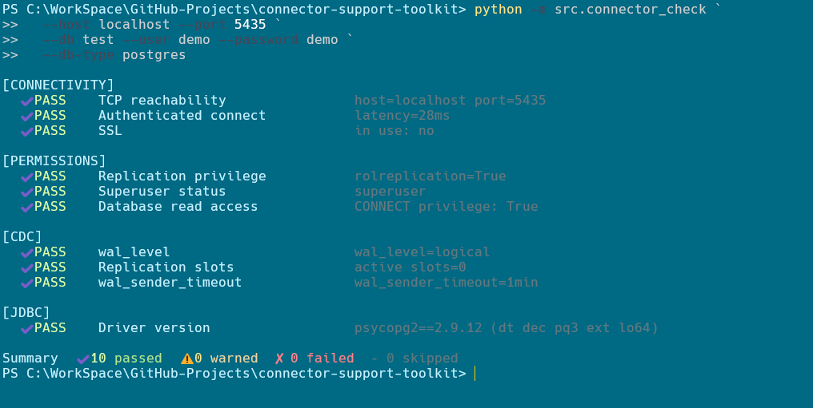
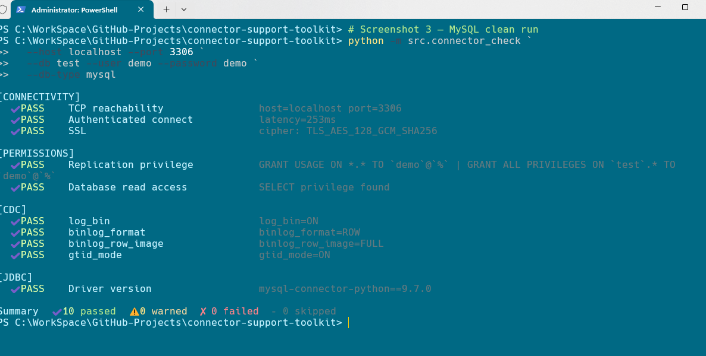
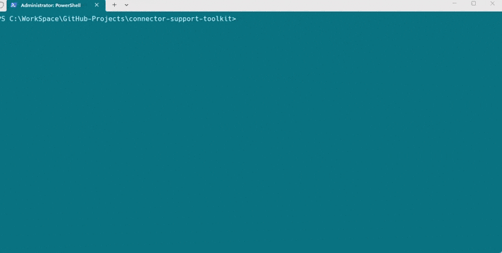

# 🛠️ Connector Support Toolkit

> CLI tool to validate database connector readiness for PostgreSQL, MySQL, MongoDB, and Redshift —
> runs connectivity, permissions, CDC, and driver checks and reports results in the
> terminal or as a JSON file.


---

## Overview

A CLI diagnostic tool that validates whether a database is ready to be used as a
connector source. It checks connectivity, permissions, CDC configuration, and driver
compatibility — helping support engineers and developers quickly identify blockers
before escalation.

Each check returns `PASS`, `WARN`, `FAIL`, or `SKIP`. A `FAIL` on any connectivity
check automatically skips all downstream categories. Failed and warned checks print
a remediation hint showing the exact SQL or config change needed.



---

## Tech stack

- **Language** — Python 3.10+
- **Databases** — PostgreSQL 15, MySQL 8.0, MongoDB 6+ (replica set), Amazon Redshift
- **Libraries** — psycopg2-binary, mysql-connector-python, pymongo, rich, pyyaml
- **Infrastructure** — Docker Compose (local integration testing)
- **Output** — Terminal (colour-coded via rich) or JSON report file

---

## Project structure

```
connector-support-toolkit/
├── src/
│   ├── connector_check.py        ← backward-compat entrypoint shim
│   └── connector_toolkit/
│       ├── __init__.py
│       ├── cli.py                ← arg parsing + subcommands (run, compare)
│       ├── runner.py             ← orchestration + exit codes
│       ├── base.py               ← BaseConnector ABC
│       ├── models.py             ← CheckResult, RunConfig, RunReport dataclasses
│       ├── config.py             ← YAML config loader + env-var interpolation
│       ├── diff.py               ← report comparison engine
│       ├── remediation.py        ← all remediation hint strings
│       ├── checks/
│       │   ├── postgres.py
│       │   ├── mysql.py
│       │   ├── mongo.py
│       │   └── redshift.py
│       └── reporters/
│           ├── terminal.py
│           ├── json_report.py
│           └── diff_reporter.py
├── tests/                        ← 174 tests, no live DB required
├── docker/
│   └── docker-compose.yml
├── docs/
│   ├── screenshots/
│   ├── postgres-connector-debugging.md
│   ├── mysql-connector-debugging.md
│   ├── cdc-readiness-checklist.md
│   └── jdbc-troubleshooting.md
├── pyproject.toml
├── toolkit.example.yml           ← config file template
├── CHANGELOG.md
└── CONTRIBUTING.md
```

---

## Getting started

### Prerequisites

- Python 3.10 or later
- pip
- Docker (for local integration testing only)

### Step 1 — install

```bash
git clone https://github.com/musabe/connector-support-toolkit
cd connector-support-toolkit
pip install -e ".[dev]"
```

The editable install puts `connector_toolkit` on your path permanently.
No `PYTHONPATH` or environment variables needed.

### Step 2 — run against a database

**Option A — CLI flags (quickest for one-off checks):**

```bash
# PostgreSQL
python -m src.connector_check \
  --host localhost --port 5432 \
  --db mydb --user myuser --password mypassword \
  --db-type postgres

# MySQL
python -m src.connector_check \
  --host localhost --port 3306 \
  --db mydb --user myuser --password mypassword \
  --db-type mysql

# MongoDB
python -m src.connector_check \
  --host localhost --port 27017 \
  --db mydb --user myuser --password mypassword \
  --db-type mongo

# Redshift
python -m src.connector_check \
  --host my-cluster.us-east-1.redshift.amazonaws.com --port 5439 \
  --db dev --user admin --password mypassword \
  --db-type redshift
```

**Option B — config file (recommended for repeated use and CI):**

```bash
cp toolkit.example.yml toolkit.yml
# Edit toolkit.yml — use ${ENV_VAR} for secrets

python -m src.connector_check --config toolkit.yml
```

A minimal `toolkit.yml`:

```yaml
host:     ${DB_HOST:-localhost}
port:     ${DB_PORT:-5432}
db:       ${DB_NAME:-mydb}
user:     ${DB_USER:-myuser}
password: ${DB_PASSWORD}          # required — set in environment
db_type:  postgres
timeout:  10
skip:     []
```

CLI flags always override config file values:

```bash
python -m src.connector_check --config toolkit.yml --db-type mysql
```

### Full usage reference

```
python -m src.connector_check [run] [--config PATH] [--host HOST] [--port PORT]
                               [--db DB] [--user USER] [--password PASSWORD]
                               [--db-type {postgres,mysql,mongo,redshift}]
                               [--skip CATEGORIES] [--output-file PATH]
                               [--timeout SECONDS]

python -m src.connector_check compare BEFORE AFTER [--output-file PATH]

Arguments:
  --config PATH          YAML config file (env-var interpolation supported)
  --host HOST            Database hostname or IP
  --port PORT            TCP port
  --db DB                Database / schema name
  --user USER            Database user
  --password PASSWORD    Database password
  --db-type              One of: postgres, mysql, mongo, redshift
  --skip CATEGORIES      Comma-separated categories to skip:
                         connectivity,permissions,cdc,jdbc
  --output-file PATH     Write JSON report to file instead of terminal
  --timeout SECONDS      Connection timeout in seconds (default: 10)
```

---

## What it checks

| Category | Check | PostgreSQL | MySQL | MongoDB | Redshift |
|----------|-------|:---:|:---:|:---:|:---:|
| **connectivity** | TCP reachability | ✓ | ✓ | ✓ | ✓ |
| | Authenticated connect (with latency) | ✓ | ✓ | ✓ | ✓ |
| | SSL / TLS status | ✓ | ✓ | ✓ | ✓ |
| **permissions** | Replication privilege | ✓ | ✓ | — | ✓ |
| | Database read access | ✓ | ✓ | ✓ | ✓ |
| | Superuser / GRANTS | ✓ | ✓ | — | ✓ |
| | Schema access | — | — | — | ✓ |
| | Change stream access | — | — | ✓ | — |
| **cdc** | WAL level = logical | ✓ | — | — | ✓ |
| | Replication slots | ✓ | — | — | ✓ |
| | wal_sender_timeout | ✓ | — | — | ✓ |
| | log_bin enabled | — | ✓ | — | — |
| | binlog_format = ROW | — | ✓ | — | — |
| | binlog_row_image = FULL | — | ✓ | — | — |
| | gtid_mode = ON | — | ✓ | — | — |
| | Replica set topology | — | — | ✓ | — |
| | Oplog window (≥ 24 h) | — | — | ✓ | — |
| | Change stream smoke-test | — | — | ✓ | — |
| **jdbc** | Driver version | ✓ | ✓ | ✓ | ✓ |

---

## Output

### All checks passing


### MySQL — all checks passing



### FAIL with remediation hint

When a check fails the tool prints the exact SQL or config command to fix it.
Downstream categories are automatically skipped until connectivity is restored.


### JSON (`--output-file report.json`)

```json
{
  "timestamp": "2026-05-10T10:00:00+00:00",
  "host": "localhost",
  "db_type": "postgres",
  "summary": { "passed": 10, "warned": 0, "failed": 0, "skipped": 0 },
  "checks": [
    {
      "category": "connectivity",
      "name": "TCP reachability",
      "status": "PASS",
      "detail": "host=localhost port=5435"
    }
  ]
}
```

---

## Compare reports

Run the tool twice and diff the results — useful after fixing a config issue or
as a CI gate to catch regressions between deployments.

```bash
# Before — save a baseline
python -m src.connector_check --config toolkit.yml --output-file reports/before.json

# After a config change — save a new report
python -m src.connector_check --config toolkit.yml --output-file reports/after.json

# Diff them
python -m src.connector_check compare reports/before.json reports/after.json
```



The compare command exits `0` if there are no regressions, `1` if any check got
worse — making it directly usable as a CI gate.

---

## Exit codes

| Code | Meaning | Recommended action |
|------|---------|-------------------|
| `0` | All checks passed | Safe to proceed |
| `1` | One or more FAILs | Fix before connecting — the connector will not work |
| `2` | Warns only, no FAILs | Investigate before going to production |
| `3` | All checks skipped | Check your `--skip` flags — nothing ran |

Use in CI/CD:

```bash
# Fail pipeline on any FAIL or WARN
python -m src.connector_check --config toolkit.yml || exit 1

# Fail only on hard FAIL, tolerate WARNs
python -m src.connector_check --config toolkit.yml
code=$?; [ $code -eq 1 ] && exit 1 || exit 0
```

---

## What to do when a check fails

See [`README-whattodo.md`](README-whattodo.md) for the full failure reference — a
table for every FAIL and WARN across all four databases with the exact SQL or
config command to fix it.

Quick reference for the most common blockers:

| Failure | Fix |
|---------|-----|
| TCP reachability FAIL | Check firewall rules. Try `nc -zv <host> <port>` |
| Authenticated connect FAIL (PG) | Check `pg_hba.conf` auth method and CONNECT privilege |
| Authenticated connect FAIL (MySQL) | User may be host-scoped to `localhost` — check `mysql.user` |
| `wal_level` FAIL | `ALTER SYSTEM SET wal_level = logical;` + PG restart |
| Replication privilege FAIL (PG) | `ALTER ROLE <user> REPLICATION;` |
| `log_bin` FAIL | Add `log_bin=...` to `my.cnf` + MySQL restart |
| Replica set topology FAIL | Standalone MongoDB — must convert to replica set |

---

## Local development

### Install and run tests

```bash
pip install -e ".[dev]"
pytest tests/
```

Tests use mock connections — no live database required for the unit test suite.
174 tests across 11 files covering all four connectors, reporters, diff engine,
config loading, exit codes, CLI parsing, and runner orchestration.

### Docker integration environment

```bash
cd docker && docker compose up -d
```

Starts:
- **PostgreSQL 15** on port `5435` (`wal_level=logical`, credentials `demo/demo`, db `test`)
- **MySQL 8.0** on port `3306` (binlog ROW, GTID ON, credentials `demo/demo`, db `test`)

```bash
# PostgreSQL
python -m src.connector_check \
  --host localhost --port 5435 \
  --db test --user demo --password demo \
  --db-type postgres

# MySQL
python -m src.connector_check \
  --host localhost --port 3306 \
  --db test --user demo --password demo \
  --db-type mysql
```

---

## Adding a new database connector

1. Create `src/connector_toolkit/checks/<db>.py` — subclass `BaseConnector`,
   implement the four check methods.
2. Add remediation hints to `src/connector_toolkit/remediation.py`.
3. Register in `src/connector_toolkit/runner.py`: one line in `CONNECTOR_REGISTRY`.
4. Export from `src/connector_toolkit/checks/__init__.py`.
5. Write tests in `tests/test_<db>.py`.

See [`CONTRIBUTING.md`](CONTRIBUTING.md) for the full guide and PR checklist.

---

## Reference docs

| File | Contents |
|------|----------|
| `docs/postgres-connector-debugging.md` | Deep-dive on PostgreSQL CDC setup |
| `docs/mysql-connector-debugging.md` | Deep-dive on MySQL binlog setup |
| `docs/cdc-readiness-checklist.md` | Pre-flight checklist for all databases |
| `docs/jdbc-troubleshooting.md` | Driver compatibility and JDBC issues |
| `README-whattodo.md` | Full failure reference table |
| `CHANGELOG.md` | Version history and upgrade notes |
| `CONTRIBUTING.md` | Contributor guide and PR checklist |

---

## Status

| Feature | Status |
|---------|--------|
| PostgreSQL checks (connectivity, permissions, CDC, JDBC) | ✅ Done |
| MySQL checks (connectivity, permissions, CDC, JDBC) | ✅ Done |
| MongoDB checks (connectivity, permissions, CDC, JDBC) | ✅ Done |
| Redshift checks (connectivity, permissions, CDC, JDBC) | ✅ Done |
| Remediation hints on all FAIL / WARN results | ✅ Done |
| JSON report output | ✅ Done |
| Report diff / compare subcommand | ✅ Done |
| YAML config file with env-var interpolation | ✅ Done |
| Exit codes for CI/CD gating (0/1/2/3) | ✅ Done |
| Pluggable connector + reporter architecture | ✅ Done |
| Docker integration test environment | ✅ Done |
| Snowflake connector | 🔜 Planned |

---

## Author

**Mustapha Abella**
Senior Technical Support Engineer
Focused on API-driven SaaS, data integration, and developer-facing support

[github.com/mabella1](https://github.com/musabe)
